<div align="center">

# EduConnect

**Web Programming Lab Project — Khalid Ahammed (2207035)**

_Department of Computer Science & Engineering_
_Khulna University of Engineering & Technology (KUET)_

A premium academic workspace that brings a university student's courses, deadlines,
materials, curated tools, communities, and research into one focused, honest dashboard.

`Laravel 13` · `PostgreSQL 18` · `Next.js 16` · `React 19` · `TypeScript 6` · `Tailwind CSS 4`

</div>

---

## Overview

Students already have a dozen tools — flashcard apps, citation managers, AI assistants, drives,
and group chats. What they lack is a single place that turns _"I need to do this"_ into
_"it's done and stored where I'll find it."_ **EduConnect** closes that gap.

It unifies courses, tasks, deadlines, academic files, curated AI tools, prompts, workflows,
templates, communities, mentors, and research work into one dashboard, so a student can always
see what to do next, choose the right academic workflow, and stay organized without scattered
files, links, emails, and chats.

The project is built on three principles:

- **Academic integrity first** — every recommendation carries its reasoning, and every AI
  suggestion is _review-first_: nothing is written to a student's workspace without explicit
  confirmation.
- **No fabricated numbers** — all progress is computed from the student's own real records.
  There are no streaks, badges, or vanity metrics; an empty week honestly says so.
- **Private by default** — academic data is isolated per student, private files use signed
  access, and authorization is always enforced by the backend.

The system ships as three independently deployable surfaces: a **public marketing site with a
live demo**, the **student application**, and a separate **administration console**.

---

## Key Features

| Area                                      | What it does                                                                                                                                                  |
| ----------------------------------------- | ------------------------------------------------------------------------------------------------------------------------------------------------------------- |
| **Registration & Onboarding**             | Email registration and a guided six-step wizard (institution → program → term → courses → goals → first source) that shapes a real workspace.                 |
| **Truthful Dashboard**                    | A personalized home composed from real records — today's classes, open tasks, what's next, and honest progress.                                               |
| **Smart Intake**                          | Upload a file or paste a link; a background pipeline extracts text and proposes tasks and resources _with reasons_ — you review and confirm every suggestion. |
| **Planner**                               | Weekly schedule, deadlines, and focus sessions in a timezone-correct private workspace.                                                                       |
| **Resources**                             | A private library for PDFs, images, notes, and links, with a strict upload lifecycle and signed downloads.                                                    |
| **Second Brain & Research**               | Searchable knowledge base and research-topic tracking with reading progress.                                                                                  |
| **Tools, Prompts, Workflows & Templates** | Goal-based guidance — curated tools, editable prompts, step-by-step workflow recipes, and copyable templates, each with academic-integrity notes.             |
| **Communities & Mentors**                 | Curated academic communities and mentor discovery with help requests.                                                                                         |
| **AI Copilot**                            | An advisory assistant that reads a summary of your workspace, explains what you're seeing, and suggests a real next step — it never changes your records.     |
| **Administration Console**                | Users & roles, content curation (draft → review → publish), moderation, and a live operational analytics dashboard.                                           |

> **Excluded from scope (by design):** paid marketplaces, mentor payments, full email/drive
> synchronization, unlimited AI chat, and native mobile apps.

---

## Screens & Flows

### Public site & Live Demo

<table>
<tr>
<td width="50%">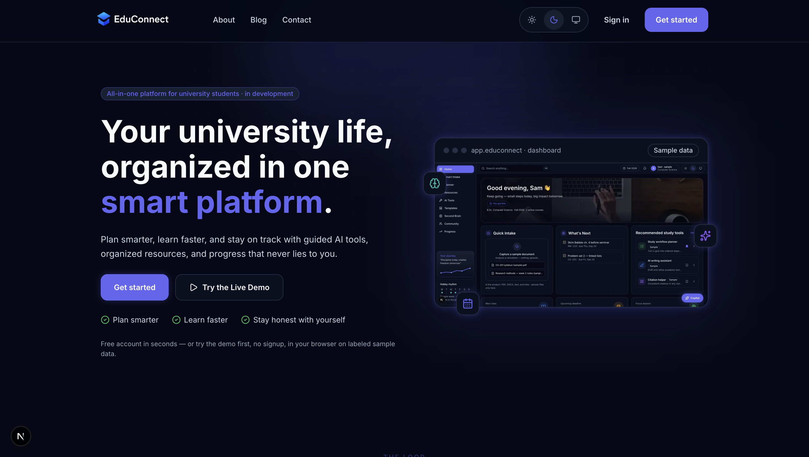<br><sub><b>Home</b> — the landing page with a real product preview.</sub></td>
<td width="50%">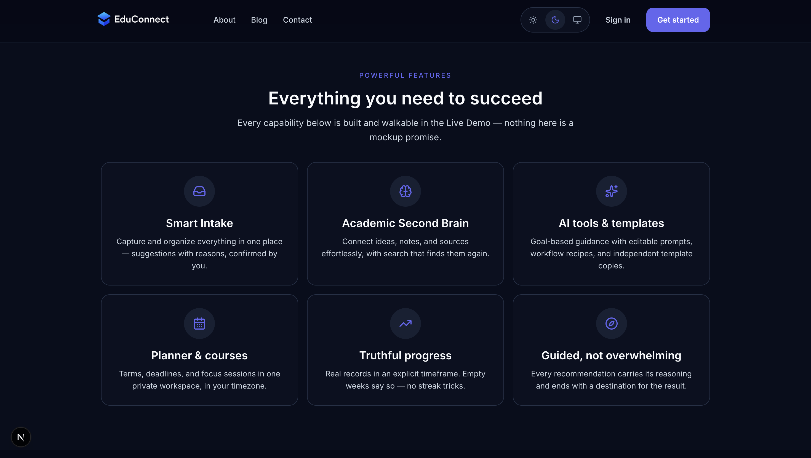<br><sub><b>Features</b> — every capability is walkable in the live demo.</sub></td>
</tr>
</table>

### Onboarding — a six-step academic setup

<table>
<tr>
<td width="33%">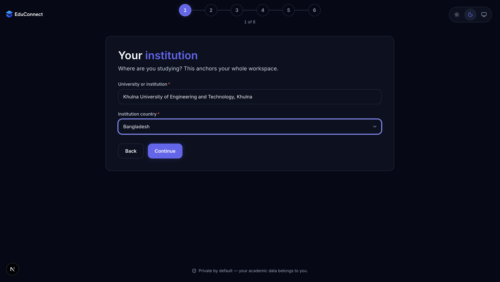<br><sub><b>1 · Institution</b></sub></td>
<td width="33%">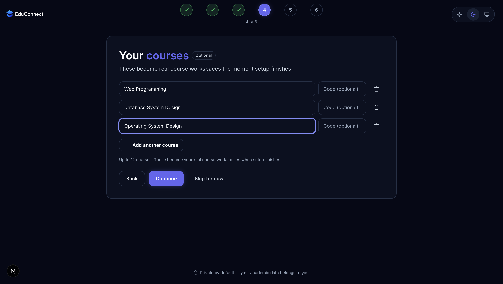<br><sub><b>4 · Courses</b></sub></td>
<td width="33%">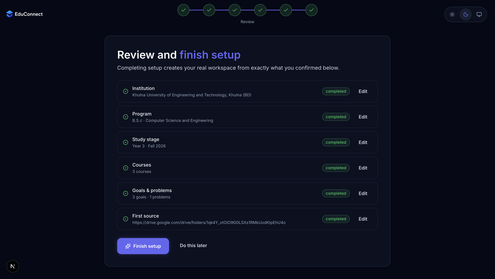<br><sub><b>Review & finish</b></sub></td>
</tr>
</table>

### Student workspace

<table>
<tr>
<td width="50%">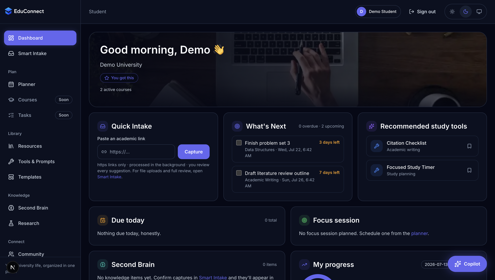<br><sub><b>Dashboard</b> — real records, truthful progress.</sub></td>
<td width="50%">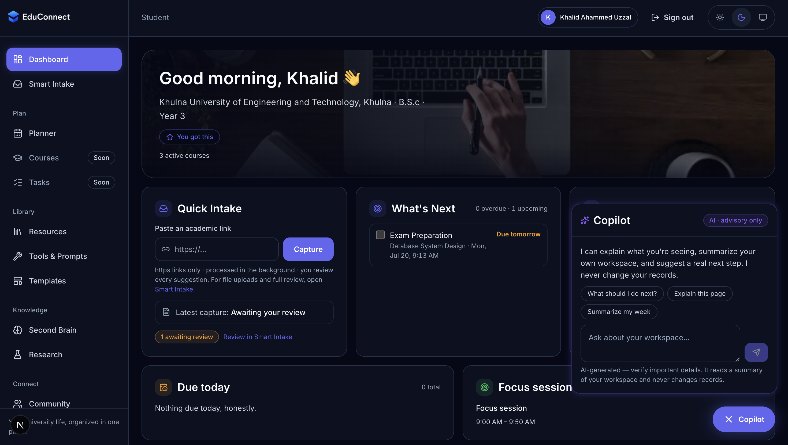<br><sub><b>AI Copilot</b> — advisory only; never changes records.</sub></td>
</tr>
<tr>
<td width="50%">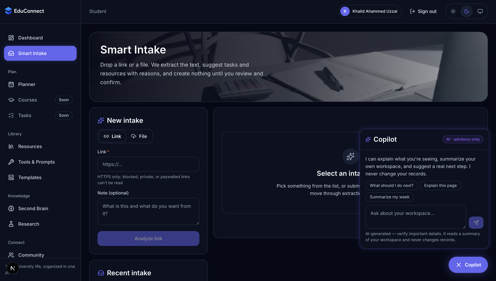<br><sub><b>Smart Intake</b> — extract, suggest, review, confirm.</sub></td>
<td width="50%">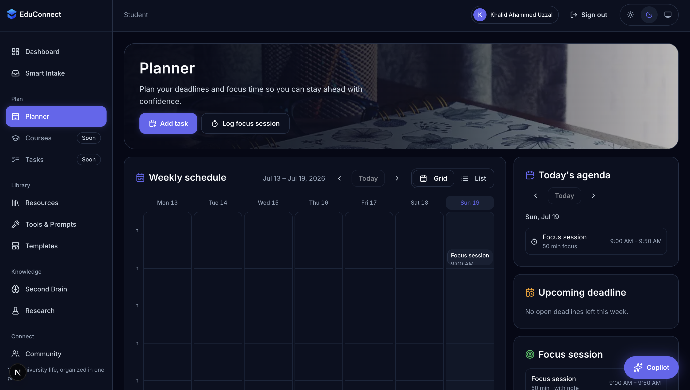<br><sub><b>Planner</b> — weekly schedule, deadlines, focus.</sub></td>
</tr>
<tr>
<td width="50%">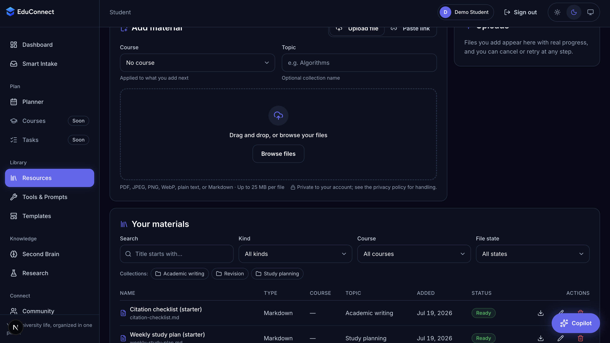<br><sub><b>Resources</b> — private library, files & links.</sub></td>
<td width="50%">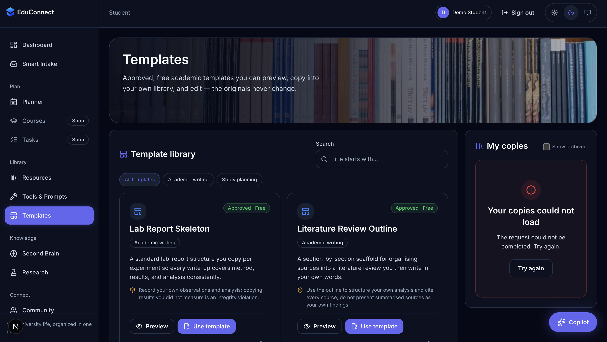<br><sub><b>Templates</b> — copy into your own library and edit.</sub></td>
</tr>
<tr>
<td width="50%">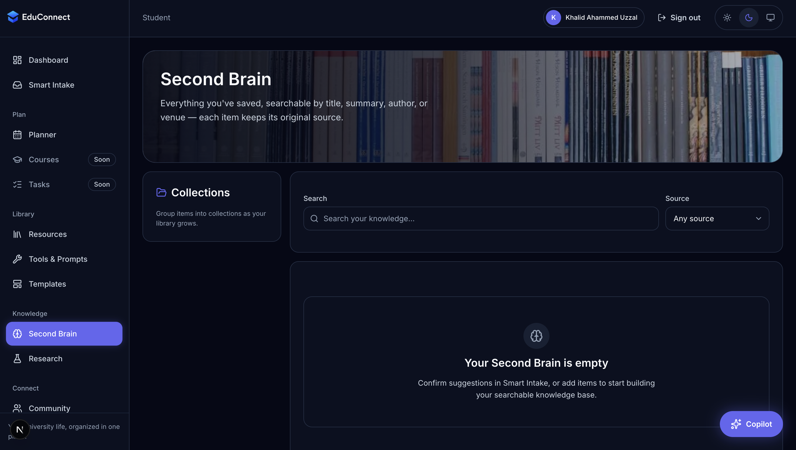<br><sub><b>Second Brain</b> — searchable knowledge base.</sub></td>
<td width="50%">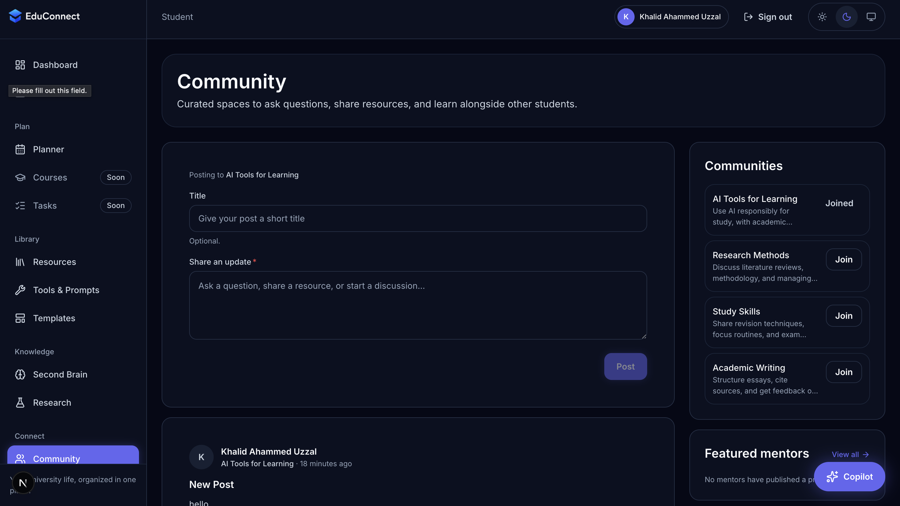<br><sub><b>Community</b> — curated academic spaces.</sub></td>
</tr>
</table>

### Administration console

<table>
<tr>
<td width="50%">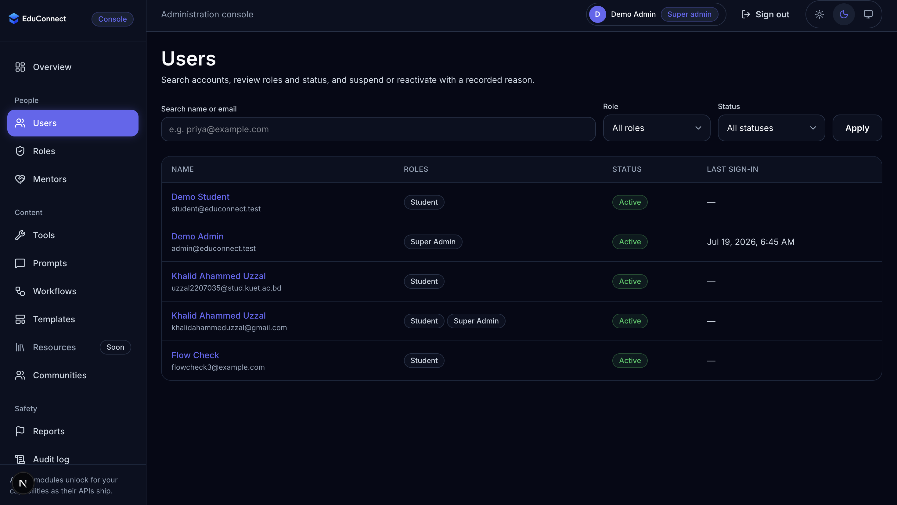<br><sub><b>Users</b> — roles, status, suspend/reactivate with a reason.</sub></td>
<td width="50%">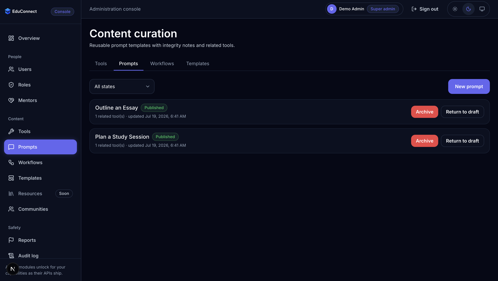<br><sub><b>Content curation</b> — draft → review → publish.</sub></td>
</tr>
</table>

> The complete set of captured screens (28) lives in [`ss/`](ss/).

---

## Architecture & Project Structure

EduConnect is a **monorepo** with a Laravel modular-monolith backend and independent Next.js
frontends. Business capabilities are separated by domain while sharing one deployable API and
one PostgreSQL database.

```text
educonnect/
├── apps/
│   ├── api/          Laravel 13 REST API — domains, policies, queued jobs
│   │   ├── app/Domains/     Auth, Users, Courses, Planner, Resources, Intake,
│   │   │                    Guidance, Templates, Community, Mentor, Admin, Copilot …
│   │   ├── database/        Migrations, seeders (incl. DemoSeeder), factories
│   │   ├── routes/          api.php, health.php
│   │   └── tests/           Feature + unit tests (PHPUnit on PostgreSQL)
│   ├── web/          Public site + student application (Next.js 16 / React 19)
│   │   └── src/{app,components,lib,providers}
│   └── admin/        Private administration console (Next.js 16)
│       └── src/{app,components,lib,providers}
├── packages/
│   ├── ui/           @educonnect/ui — shared, source-shipped design system
│   └── config/       Shared TypeScript / ESLint / Prettier config
├── ss/               Screenshots of every screen (used in this README)
└── .github/          CI workflows (API CI + security scanning)
```

**How it fits together**

- The **student browser** talks to a same-origin gateway that proxies API and Sanctum requests
  to Laravel; the **administration console** runs on its own origin with a separate session
  boundary.
- Slow or unreliable work (extraction, AI classification, notifications) runs on **queues**;
  private academic files live in **object storage** behind signed URLs.
- **Authorization is deny-by-default** and enforced by backend policies — the frontends only
  _shape_ navigation.

### Technology Stack

| Layer          | Technology                                                                          |
| -------------- | ----------------------------------------------------------------------------------- |
| Backend        | Laravel 13.17 · PHP 8.5                                                             |
| Database       | PostgreSQL 18                                                                       |
| Cache & queues | Database driver (Redis/Valkey-ready)                                                |
| Object storage | S3-compatible (Cloudflare R2), with a local-disk mode for development               |
| Frontend       | Next.js 16.2 · React 19.2 · TypeScript 6.0                                          |
| Styling & UI   | Tailwind CSS 4.3 · shared `@educonnect/ui` component library                        |
| AI             | OpenAI (Smart Intake classification & Copilot), with deterministic non-AI fallbacks |
| Tooling        | Node.js 24.18 · pnpm 11.11 · Composer 2.10                                          |

### Quality & Security Highlights

- Deny-by-default authorization, per-student data isolation, and a distinct admin security
  boundary with step-up re-authentication for high-risk actions.
- Cookie/session authentication (Sanctum SPA), CSRF validation, exact origin allowlists, and
  layered account/IP rate limiting.
- Automated quality gate: code formatting, static analysis (PHPStan level 6), OpenAPI contract
  validation, and a full PHPUnit + Vitest + Playwright test suite, run in CI.

---

## Getting Started

### Prerequisites

- PHP **8.5**, Composer **2.10**
- PostgreSQL **18**
- Node.js **24.18** and pnpm **11.11** (via Corepack)

### 1. Install dependencies

```bash
corepack enable
pnpm run install:all          # workspace metadata + lock-backed PHP dependencies
```

### 2. Create the databases and initialize the API

```bash
createdb educonnect
createdb educonnect_test

cd apps/api
cp .env.example .env
php artisan key:generate
php artisan migrate
```

### 3. (Optional) Seed demo data

Populates the guidance catalog, templates, and two ready-to-use accounts:

```bash
php artisan db:seed --class=DemoSeeder
```

| Account       | Email                     | Password       |
| ------------- | ------------------------- | -------------- |
| Administrator | `admin@educonnect.test`   | `Password123!` |
| Student       | `student@educonnect.test` | `Password123!` |

### 4. Run the applications

```bash
cd apps/api   && php artisan serve        # API            → http://localhost:8000
cd apps/api   && php artisan queue:work   # background jobs (intake, AI, email)
cd apps/web   && pnpm dev                 # student app    → http://localhost:3000
cd apps/admin && pnpm dev                 # admin console  → http://localhost:3001
```

### 5. Verify the quality gate

```bash
pnpm run check          # versions, formatting, static analysis, contracts, tests, builds
pnpm run audit          # dependency advisories
```

---

<div align="center">
<sub>EduConnect · Web Programming Lab Project · Khalid Ahammed (2207035) · KUET CSE</sub>
</div>
